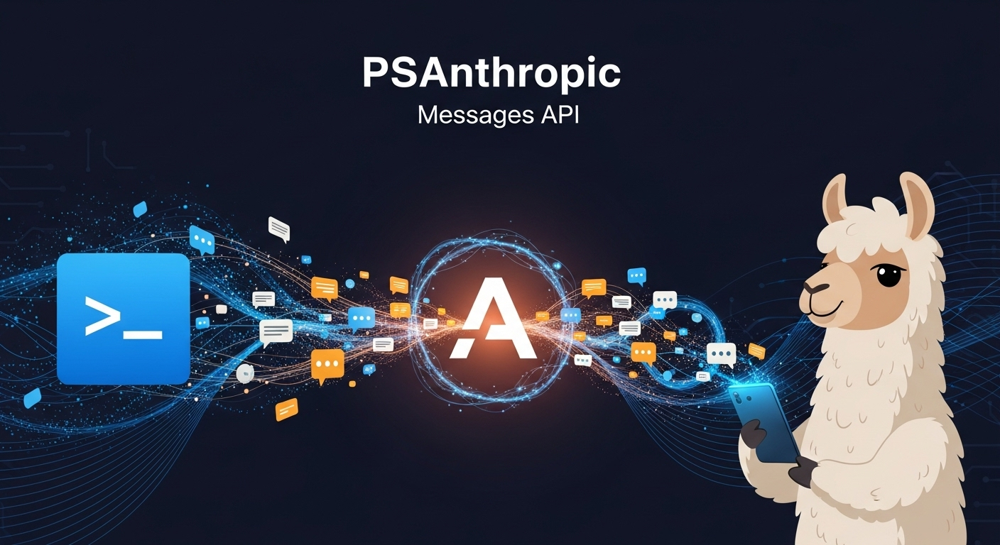

# PSAnthropic



PowerShell client for the Anthropic Messages API.

## Overview

PSAnthropic provides a PowerShell 7+ interface to the [Anthropic Messages API](https://docs.anthropic.com/en/api/messages). It works with:

- **[Ollama](https://ollama.com/)** - Local LLMs via [Anthropic API compatibility](https://docs.ollama.com/api/anthropic-compatibility)
- **Anthropic Cloud** - Claude models directly
- **Any Anthropic-compatible endpoint**

## Requirements

- PowerShell 7.0+
- An Anthropic-compatible endpoint (Ollama, Anthropic API, etc.)

## Installation

```powershell
# From source
git clone https://github.com/christaylorcodes/PSAnthropic
Import-Module ./PSAnthropic/PSAnthropic

# Future: From PowerShell Gallery
# Install-Module PSAnthropic
```

## Quick Start

```powershell
# Connect to local Ollama
Connect-Anthropic -Model 'llama3'

# Send a message
$response = Invoke-AnthropicMessage -Messages @(
    New-AnthropicMessage -Role 'user' -Content 'What is PowerShell?'
)

# Get the response text
$response | Get-AnthropicResponseText
```

## Features

### Basic Messaging

```powershell
$response = Invoke-AnthropicMessage -Messages @(
    New-AnthropicMessage -Role 'user' -Content 'Explain recursion'
) -System 'You are a programming tutor. Be concise.'
```

### Streaming

```powershell
Invoke-AnthropicMessage -Messages @(
    New-AnthropicMessage -Role 'user' -Content 'Write a haiku'
) -Stream | ForEach-Object {
    if ($_.type -eq 'content_block_delta') {
        Write-Host $_.delta.text -NoNewline
    }
}
```

### Conversations

```powershell
$conv = New-AnthropicConversation -UserMessage 'Hello!' -SystemPrompt 'You are helpful.'
$response = Invoke-AnthropicMessage -Messages $conv.Messages -System $conv.SystemPrompt

Add-AnthropicMessage -Conversation $conv -Response $response
Add-AnthropicMessage -Conversation $conv -Role 'user' -Content 'Tell me more.'
```

### Extended Thinking

```powershell
$response = Invoke-AnthropicMessage -Messages @(
    New-AnthropicMessage -Role 'user' -Content 'Solve this step by step: 15% of 85'
) -Thinking -ThinkingBudget 1024
```

### Image Analysis

```powershell
$response = Invoke-AnthropicMessage -Messages @(@{
    role = 'user'
    content = @(
        @{ type = 'text'; text = 'Describe this image.' }
        (New-AnthropicImageContent -Path './photo.jpg')
    )
}) -Model 'llava'
```

## Documentation

- [Tool Use Guide](docs/ToolUse.md) - Custom tools and tool-calling patterns
- [Standard Tools](docs/StandardTools.md) - Built-in tools and safety levels
- [Model Router](docs/Router.md) - Automatic model routing by task type
- [Troubleshooting](docs/Troubleshooting.md) - Common errors and solutions
- [Changelog](CHANGELOG.md) - Version history

## Available Functions

### Authentication

| Function | Description |
|----------|-------------|
| `Connect-Anthropic` | Initialize connection to API endpoint |
| `Disconnect-Anthropic` | Clear connection state |

### Messages

| Function | Description |
|----------|-------------|
| `Invoke-AnthropicMessage` | Send messages to the API |
| `New-AnthropicMessage` | Create a message object |
| `New-AnthropicConversation` | Start a conversation with optional system prompt |
| `Add-AnthropicMessage` | Add messages to a conversation |

### Tools

| Function | Description |
|----------|-------------|
| `New-AnthropicTool` | Create a custom tool definition |
| `New-AnthropicToolResult` | Create a tool result message |
| `Get-AnthropicStandardTools` | Get pre-built standard tools |
| `Invoke-AnthropicStandardTool` | Execute a standard tool call |

### Content

| Function | Description |
|----------|-------------|
| `New-AnthropicImageContent` | Create an image content block |

### Utility

| Function | Description |
|----------|-------------|
| `Get-AnthropicConnection` | Show current connection info |
| `Get-AnthropicModel` | List available models |
| `Get-AnthropicResponseText` | Extract text from response |
| `Test-AnthropicEndpoint` | Health check endpoint |

### Router

| Function | Description |
|----------|-------------|
| `Set-AnthropicRouterConfig` | Configure model routing rules |
| `Get-AnthropicRouterConfig` | View routing configuration |
| `Clear-AnthropicRouterConfig` | Reset routing configuration |
| `Invoke-AnthropicRouted` | Send messages with automatic routing |
| `Get-AnthropicRouterLog` | View routing decision history |

## Configuration

### Environment Variables

```powershell
$env:ANTHROPIC_BASE_URL = 'localhost:11434'
$env:ANTHROPIC_API_KEY = 'ollama'
$env:ANTHROPIC_MODEL = 'llama3'
```

### Connect Options

```powershell
# Local Ollama (default)
Connect-Anthropic -Model 'qwen3-coder'

# Specific server
Connect-Anthropic -Server 'myserver:11434' -Model 'llama3'

# Anthropic cloud
Connect-Anthropic -Server 'api.anthropic.com' -ApiKey $key -Model 'claude-3-5-sonnet'
```

## Ollama Compatibility

This module is designed to work seamlessly with [Ollama's Anthropic compatibility layer](https://docs.ollama.com/api/anthropic-compatibility). When using Ollama:

**Supported:**

- Messages API (`/v1/messages`)
- Streaming
- Tools/function calling
- Base64 images
- System prompts
- Temperature, top_p, top_k

**Not Supported by Ollama:**

- Token counting endpoint
- URL-based images (base64 only)
- Cache control blocks
- Batches API
- PDF documents

## License

MIT License - See [LICENSE](LICENSE) for details.
