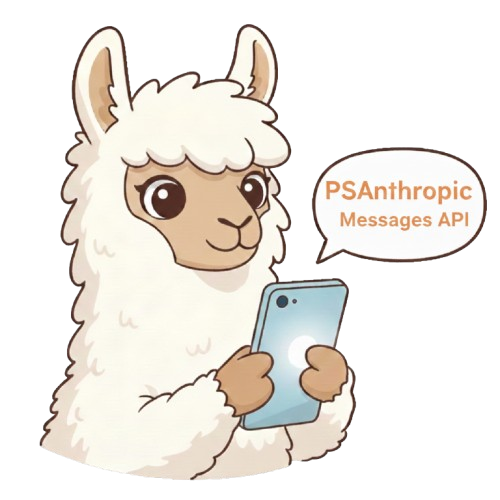

# PSAnthropic



PowerShell 7+ client for the Anthropic Messages API.

## Overview

PSAnthropic provides a PowerShell interface to the [Anthropic Messages API](https://docs.anthropic.com/en/api/messages). It works with:

- **[Ollama](https://ollama.com/)** - Local LLMs via [Anthropic API compatibility](https://docs.ollama.com/api/anthropic-compatibility)
- **Anthropic Cloud** - Claude models directly
- **Any Anthropic-compatible endpoint**

## Requirements

- PowerShell 7.0+
- An Anthropic-compatible endpoint (Ollama, Anthropic API, etc.)

## Installation

```powershell
# From source
git clone https://github.com/christaylorcodes/PSAnthropic
Import-Module ./PSAnthropic/PSAnthropic

# Future: From PowerShell Gallery
# Install-Module PSAnthropic
```

## Quick Start

```powershell
# Connect to local Ollama
Connect-Anthropic -Model 'llama3'

# Send a message
$response = Invoke-AnthropicMessage -Messages @(
    New-AnthropicMessage -Role 'user' -Content 'What is PowerShell?'
)

# Get the response text
$response.Answer
```

## Key Features

### Streaming Responses

Real-time token streaming with Server-Sent Events (SSE):

```powershell
Invoke-AnthropicMessage -Messages @(
    New-AnthropicMessage -Role 'user' -Content 'Write a haiku'
) -Stream | ForEach-Object {
    if ($_.type -eq 'content_block_delta') {
        Write-Host $_.delta.text -NoNewline
    }
}
```

### Tool Calling

Built-in standard tools for file operations, shell commands, and web fetching:

```powershell
$tools = Get-AnthropicStandardTools
$response = Invoke-AnthropicMessage -Messages $messages -Tools $tools -AllowShell
```

Auto-generate tool definitions from any PowerShell command:

```powershell
$tool = New-AnthropicToolFromCommand -CommandName 'Get-Process'
```

### Vision / Image Analysis

Analyze images with vision-capable models:

```powershell
$response = Invoke-AnthropicMessage -Messages @(@{
    role = 'user'
    content = @(
        @{ type = 'text'; text = 'Describe this image.' }
        (New-AnthropicImageContent -Path './photo.jpg')
    )
}) -Model 'llava'
```

### Extended Thinking

Enable model reasoning for complex problems (Claude 3+ models):

```powershell
$response = Invoke-AnthropicMessage -Messages @(
    New-AnthropicMessage -Role 'user' -Content 'Solve this step by step: 15% of 85'
) -Thinking -ThinkingBudget 1024
```

### Model Router

Automatically route requests to different models based on task type:

```powershell
Set-AnthropicRouterConfig -Models @{
    'code'    = 'qwen3-coder'
    'chat'    = 'llama3'
    'default' = 'llama3'
}
Invoke-AnthropicRouted -Messages $messages -TaskType 'code'
```

## Configuration

### Environment Variables

```powershell
$env:ANTHROPIC_BASE_URL = 'localhost:11434'
$env:ANTHROPIC_API_KEY = 'ollama'
$env:ANTHROPIC_MODEL = 'llama3'
```

### Connect Options

```powershell
# Local Ollama (default)
Connect-Anthropic -Model 'qwen3-coder'

# Specific server
Connect-Anthropic -Server 'myserver:11434' -Model 'llama3'

# Anthropic Cloud
Connect-Anthropic -Server 'api.anthropic.com' -ApiKey $key -Model 'claude-sonnet-4-20250514'
```

## Documentation

- **[Function Reference](docs/en-US/PSAnthropic.md)** - Complete list of all 23 cmdlets
- [Tool Use Guide](docs/ToolUse.md) - Custom tools and tool-calling patterns
- [Standard Tools](docs/StandardTools.md) - Built-in tools and safety levels
- [Model Router](docs/Router.md) - Automatic model routing by task type
- [Troubleshooting](docs/Troubleshooting.md) - Common errors and solutions
- [Changelog](CHANGELOG.md) - Version history

## Ollama Compatibility

This module works seamlessly with [Ollama's Anthropic compatibility layer](https://docs.ollama.com/api/anthropic-compatibility).

**Supported:** Messages API, streaming, tools/function calling, base64 images, system prompts, temperature/top_p/top_k

**Not Supported by Ollama:** Token counting, URL-based images, cache control, batches API, PDFs

## License

MIT License - See [LICENSE](LICENSE) for details.
